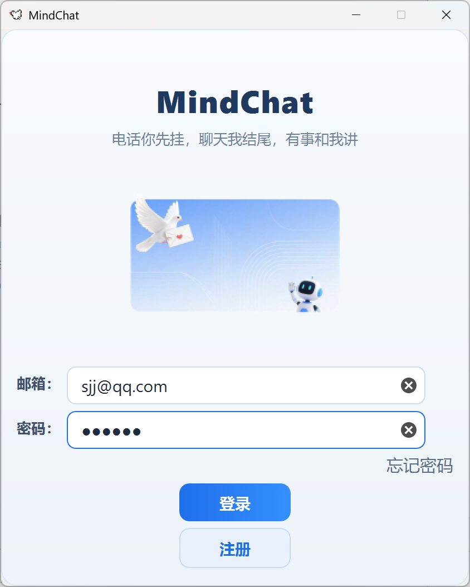
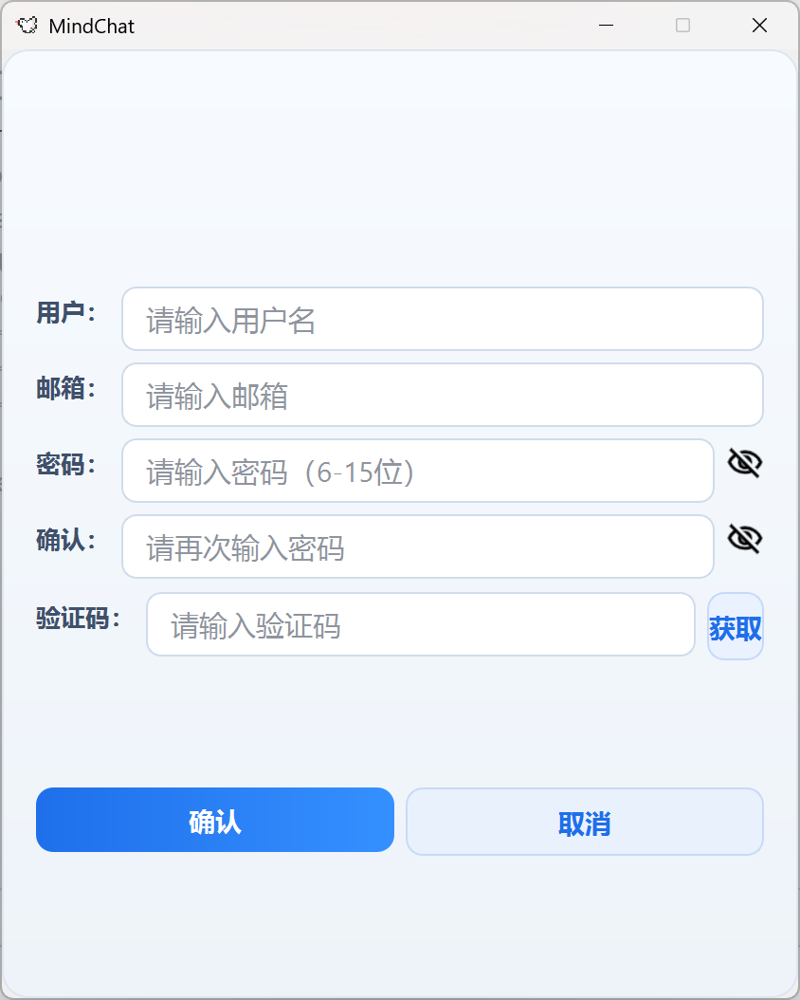
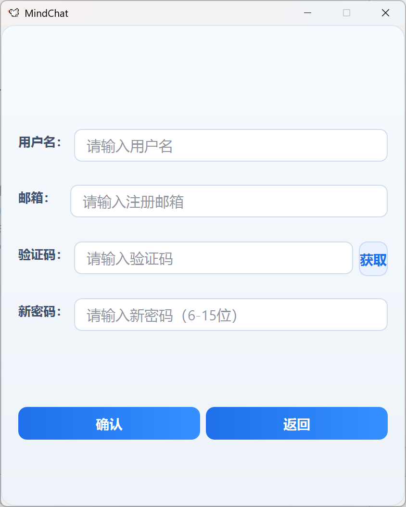
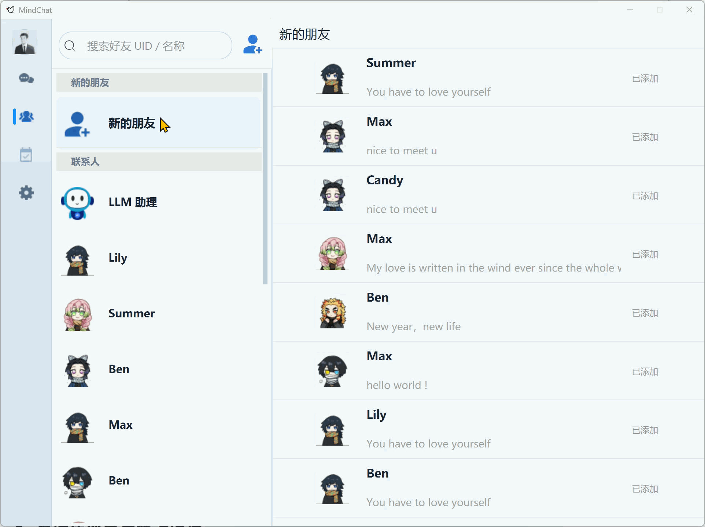
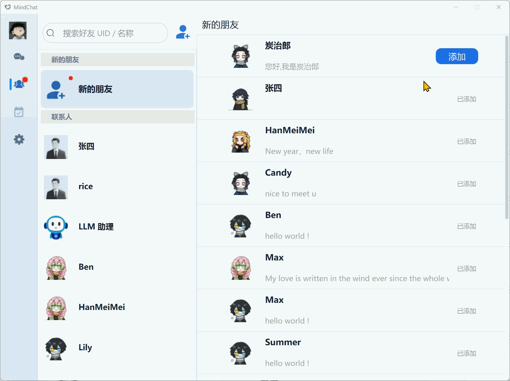
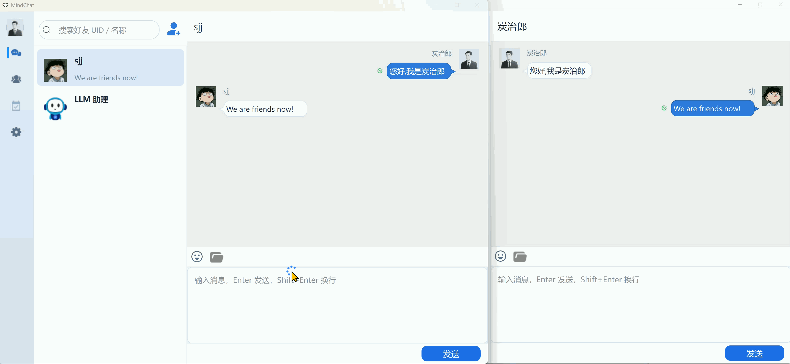
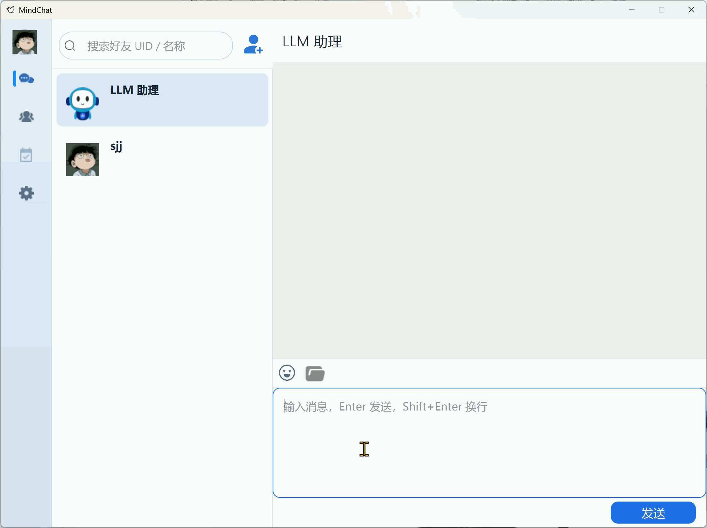
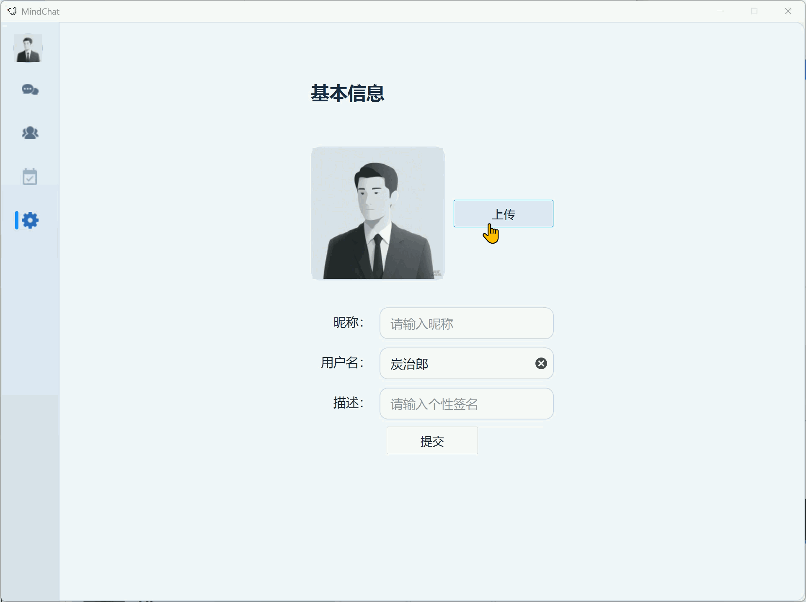
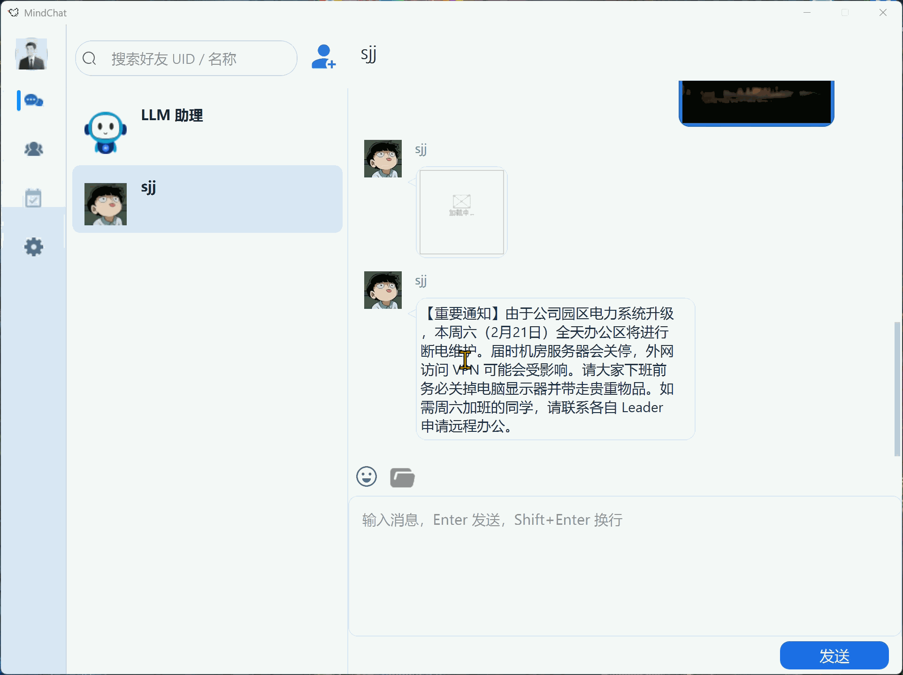
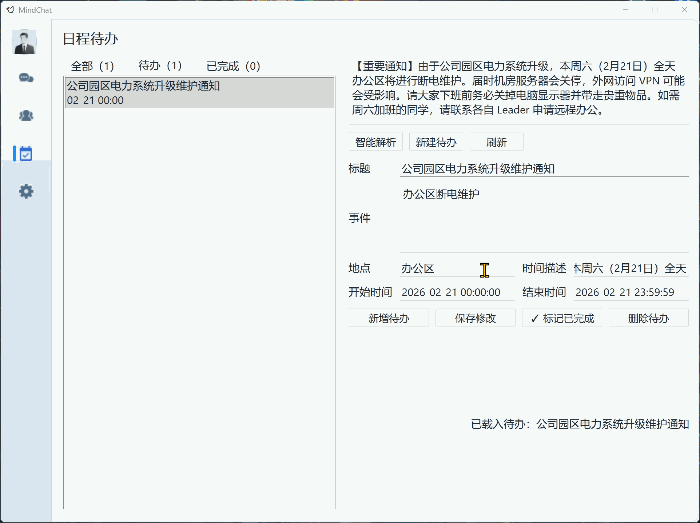

# MindChat — 具备 AI 日程管理的 C++ 分布式办公通讯平台

> 这是一个面向办公协作场景的分布式即时通讯项目，集成了 AI 驱动的智能日程待办解析能力。

------

## 项目介绍

MindChat 客户端基于 Qt 实现，后端是一组 C++ 微服务集群。核心能力覆盖：注册 / 登录 / 密码重置、好友搜索与申请、文本与图片消息收发、历史消息加载、头像上传、文件资源断点续传与进度展示，以及**智能日程待办管理**。

后端按职责拆分为七个服务：`GateServerWin` 负责 HTTP 接入和登录注册链路，`StatusServer` 负责路由分配和 token 下发，`ChatServer / ChatServer2` 负责长连接消息与会话管理，`ResourceServer` 负责文件与图片资源通道，`VarifyServer` 负责验证码服务，`LLMServer` 负责与大模型对话及待办解析。服务间通过 gRPC 协作，业务数据落在 MySQL，状态与缓存落在 Redis。

此外，项目将大模型能力引入日程待办管理：用户可以在聊天框里直接用一句话触发解析，服务端返回结构化的待办字段（标题、事件、时间、地点、置信度），支持快速编辑后一键落库，所有待办按时间顺序排列展示。

**单节点压测（WSL 环境）**：~18k 稳定连接（P95 ≤ 200ms）；10k 连接连续运行 10 分钟无掉线；pingpong 协议 100ms 约束下稳定连接约 1k。

------

## 主要功能及流程

### 1. 登录与连接建立



1. **[客户端]** `POST /user_login` → `GateServerWin` → gRPC 调用 `StatusServer.GetChatServer`
2. **[StatusServer]** 按 Redis 节点连接计数选低负载节点，生成 token 写入 Redis
3. **[GateServerWin]** 返回 `uid / token / chathost / chatport / reshost / resport`
4. **[客户端]** 建立聊天 TCP 与资源 TCP 两条连接，发送 `ID_CHAT_LOGIN`
5. **[ChatServer]** 校验 token，加载好友列表与申请列表，绑定会话；若已有在线会话则执行踢人

### 2. 注册及重置密码





1. **[客户端]** 填写邮箱，发送 `POST /get_varifycode` 到 `GateServerWin`
2. **[GateServerWin]** gRPC 调用 `VarifyServer` 生成并发送验证码，写入 Redis（带过期时间）
3. **[客户端]** 提交用户名 / 密码 / 验证码，发送 `POST /user_register`
4. **[GateServerWin]** 校验 Redis 验证码，写入 MySQL 用户数据

### 3. 好友添加（查询 → 申请 → 认证）





1. **[客户端]** 发送 `ID_SEARCH_USER_REQ` → `ChatServer` 先查 Redis，未命中查 MySQL
2. **[客户端]** 发送 `ID_ADD_FRIEND_REQ` → 写入 `friend_apply`，同节点直接通知，跨节点 gRPC 转发
3. **[客户端]** 对方同意后发送 `ID_AUTH_FRIEND_REQ` → 事务内写入双向好友关系与初始会话，通知双方

### 4. 文本聊天



1. **[客户端]** 发送 `ID_TEXT_CHAT_MSG_REQ`（含 `thread_id`）
2. **[ChatServer]** 落库 `chat_message`，回执发送方；接收方在本节点直接推送，否则 gRPC 跨节点转发
3. **[客户端]** 收到 `ID_NOTIFY_TEXT_CHAT_MSG_REQ`，更新会话与 UI

### 5. 与 LLM 助手聊天



1. **[客户端]** 用户在会话列表中选择 `LLM 助理` 会话，发送 `ID_TEXT_CHAT_MSG_REQ`（接收方为 LLM 助理 UID）
2. **[ChatServer]** 识别该消息目标为 LLM 助理，组装上下文并调用 `LLMServer /chat`
3. **[LLMServer]** 转发到大模型 provider，返回回答文本
4. **[ChatServer]** 将助手回复落库并回推 `ID_NOTIFY_TEXT_CHAT_MSG_REQ` 给客户端
5. **[客户端]** 接收助手回复并更新会话 UI，实现与助手连续对话

### 6. 多媒体消息与断点续传


1. **[客户端]** 先向 `ChatServer` 发送占位消息，再通过资源 TCP 向 `ResourceServer` 分块上传
2. **[ResourceServer]** 按分片序号落盘，进度写入 Redis；最后一片完成后更新消息状态，gRPC 通知 `ChatServer`
3. **[客户端]** 网络恢复后从最后确认分片继续，避免整文件重传；UI 实时显示进度

### 7. 上传头像



1. **[客户端]** 用户选择并裁剪头像，本地生成文件后按分块发送 `ID_UPLOAD_HEAD_ICON_REQ` 到 `ResourceServer`
2. **[ResourceServer]** 首片校验 token，后续分片按序写入；最后一片完成后更新 MySQL 用户头像字段
3. **[ResourceServer]** 同步刷新 Redis 用户缓存，保证后续登录和查询命中最新头像
4. **[客户端]** 收到上传回包后刷新本地头像显示

### 8. 智能待办（AI 驱动）





1. **[客户端]** 触发"一键转待办"，发送 `ID_PARSE_TODO_REQ` 到 `ChatServer`
2. **[ChatServer]** 调用 `LLMServer /extract_todo`，返回结构化字段（标题 / 事件 / 时间 / 地点 / 置信度）
3. **[客户端]** 用户确认后发送创建 / 更新 / 删除 / 状态切换请求，落库 `todo_item`

------


## 技术栈

| 方向       | 技术                                                            |
| ---------- | --------------------------------------------------------------- |
| 网络层     | Boost.Asio / Beast，TCP 长连接 + HTTP 接口，异步读写            |
| 服务间通信 | gRPC + Protobuf                                                 |
| 大模型集成 | LLMServer 多 key / 多地址池，轮询 + 失败重试，结构化输出解析    |
| 并发模型   | `io_context` 池 + 逻辑线程 + 资源工作线程分层处理               |
| 数据存储   | MySQL 持久化 + Redis 缓存 / 状态，分布式锁（SET NX EX + Lua）   |
| 连接池     | MySQL 连接池（含保活）、Redis 连接池、gRPC stub 池              |
| 验证码服务 | Node.js VarifyServer，gRPC 接入                                 |
| 文件传输   | 分块上传 / 下载、断点续传、拥塞窗口控制、进度回传               |
| 客户端     | Qt，信号槽解耦，异步 UI 事件驱动                                |
| 工程模式   | 单例、生产者-消费者、RAII、类型擦除分发（`std::function` 映射） |

------

## 设计亮点

### AI 驱动的日程待办解析

`LLMServer` 对外暴露 `/chat` 和 `/extract_todo` 两个接口。用户在聊天页触发"一键转待办"，系统解析自然语言（例如"明天下午三点和产品开评审会"）并返回结构化字段，前端确认后直接落库为待办项，支持创建、查询、更新、删除和状态切换。

为保证稳定性，`ProviderPool` 实现了多 key / 多地址轮询与失败重试，并保留解析失败的兜底逻辑，模型瞬时不可用不会中断业务主流程。

### 踢人机制（同账号异地登录）

新登录成功后检查旧会话所属节点：同节点直接下发离线通知并清理连接，跨节点则通过 gRPC 发送踢人请求。账号在任意时刻只保留一个有效会话。

### 心跳检测与僵尸连接回收

客户端按固定周期发送心跳，服务端在 session 中维护最后活跃时间戳，定时任务扫描超时连接并主动回收会话与在线状态，在线人数统计更准确，也防止异常连接长期占用资源。

### 负载均衡

登录阶段由 `StatusServer` 读取 Redis 中各 Chat 节点的连接计数，将请求分发到当前压力最小的节点，并下发对应地址与 token。策略轻量但有效，新增聊天节点时直接接入即可水平扩展。

### 断点续传 + 分散压力

资源传输使用分块协议，服务端将上传和下载进度写入 Redis（带 TTL），网络中断后可从最后确认序号继续。资源任务在 `ResourceServer` 内按哈希分发到不同 worker，存储目录按用户维度分层，避免单目录 / 单线程成为瓶颈。

### 分布式锁与死锁规避

关键并发路径（登录绑定、连接计数）结合 Redis 分布式锁（`SET NX EX + Lua`）保证原子性；数据库层在好友关系写入时采用固定顺序插入，降低事务锁反转导致的死锁概率。

### 类型擦除分发

消息分发层用 `std::function` + 统一回调签名建立消息 ID 到处理函数的映射，替代大段 `switch-case`。扩展协议时只需注册新处理器，不影响已有逻辑。

### 客户端拥塞窗口

上传链路维护轻量拥塞窗口，控制在飞分片数量并根据回包推进确认序列，在抖动网络下保持稳定吞吐，减少发送队列堆积和无效重传。

### 聊天与资源双通道

客户端同时维护聊天 TCP 通道和资源 TCP 通道，文本消息与大文件传输不抢同一链路，传图/传文件时不会明显影响会话交互体验。

------

## 项目结构

```text
myChat/
├── ChatServer/              # 聊天服务节点1（TCP + gRPC）
├── ChatServer2/             # 聊天服务节点2（TCP + gRPC）
├── GateServerWin/           # 网关服务（HTTP 入口，登录 / 注册 / 重置）
├── StatusServer/            # 状态与路由服务（登录分发、token 发放）
├── ResourceServer/          # 资源服务（文件 / 图片 / 头像上传下载、续传）
├── LLMServer/               # LLM 代理服务（/chat, /extract_todo）
├── VarifyServer/            # Node.js 验证码服务（gRPC）
├── myChatQT/                # Qt 客户端
├── scripts/                 # 运维脚本（一键启停、切库）
├── stress_tests/            # 压测脚本与说明
├── sql备份/                 # 数据库结构与补丁 SQL
├── DEPLOYMENT.md            # 服务端部署手册
├── CMakeLists.txt           # 服务端构建入口
└── vcpkg.json               # C++ 依赖声明
```

------

## 部署

### 环境要求

**系统依赖**

```bash
sudo apt update
sudo apt install -y build-essential cmake ninja-build pkg-config curl zip unzip tar
```

**运行依赖**

- Redis（默认 `127.0.0.1:6379`，配置密码 `123456`）
- MySQL（默认 `127.0.0.1:33060`）
- Node.js + npm（推荐 nvm）

```bash
sudo apt install -y redis-server mysql-server

# Node.js（推荐 nvm）
curl -fsSL https://raw.githubusercontent.com/nvm-sh/nvm/v0.40.1/install.sh | bash
source ~/.bashrc
nvm install --lts
```

**vcpkg**（假设安装在 `/home/<you>/vcpkg`）

```bash
cd /path/to/myChat
/home/<you>/vcpkg/vcpkg install --triplet x64-linux
```

所有 C++ 依赖（Boost / gRPC / Protobuf / hiredis / MySQL Connector / jsoncpp 等）由 `vcpkg.json` 统一管理。

------

### 配置

**Redis**：确保服务端密码为 `123456`

```conf
# /etc/redis/redis.conf
requirepass 123456
sudo systemctl restart redis-server
redis-cli -h 127.0.0.1 -p 6379 -a 123456 PING  # 返回 PONG 才算正常
```

**MySQL**：端口、账号须与各服务 `config.ini` 一致，导入库结构：

```bash
mysql -h 127.0.0.1 -P 33060 -u root -p < "sql备份/MindChat.sql"

```

**VarifyServer**：

```bash
cd VarifyServer && npm install
```

确保 npm 是 Linux 路径，不是 `/mnt/...` 或 `.exe`。

------

### 编译

> ⚠️ 如果从 Windows 迁移过来，需要先在 Linux 重新生成 pb 文件：
>
> ```bash
> # 在 ChatServer/ ChatServer2/ GateServerWin/ StatusServer/ ResourceServer/ 各执行
> protoc -I . --cpp_out=. --grpc_out=. \
>   --plugin=protoc-gen-grpc=$(which grpc_cpp_plugin) message.proto
> ```

```bash
cmake -S . -B build \
  -G "Unix Makefiles" \
  -DCMAKE_BUILD_TYPE=Release \
  -DCMAKE_TOOLCHAIN_FILE=/home/<you>/vcpkg/scripts/buildsystems/vcpkg.cmake \
  -DVCPKG_TARGET_TRIPLET=x64-linux

cmake --build build -j
```

构建产物：`build/{StatusServer,LLMServer,ChatServer,ChatServer2,ResourceServer,GateServerWin}/`

------

### 一键启动

```bash
# 启动（默认 build 目录）
scripts/manage_services.sh start build

# 查看状态
scripts/manage_services.sh status

# 查看单服务日志
scripts/manage_services.sh logs GateServerWin

# 停止
scripts/manage_services.sh stop
```

启动顺序：Redis / MySQL → VarifyServer → LLMServer → StatusServer → ChatServer → ChatServer2 → ResourceServer → GateServerWin

**可用环境变量：**

```bash
# 自定义依赖拉起命令
REDIS_START_CMD='service redis-server start' \
MYSQL_START_CMD='service mysql start' \
scripts/manage_services.sh start build

# VarifyServer 缺依赖时自动 npm install
VARIFY_AUTO_NPM_INSTALL=1 scripts/manage_services.sh start build
```

------

### 客户端

1. Qt Creator 打开 `myChatQT/myChatQT.pro`，配置编译套件后构建运行
2. 按需修改 `myChatQT/config.ini` 中的网关地址和端口

------

## 压力测试

> 服务端与压测端均为独立机器，服务端运行在 WSL（AMD 9700x），压测端为实验室 Linux 服务器。

### 准备压测环境

切换到压测数据库：

```bash
scripts/switch_db.sh stress_mysql
```

初始化压测账号（2 万个连续用户名账号）：

```bash
python3 stress_tests/run_stress.py \
  --gate-host 10.204.128.192 \
  --gate-port 8080 \
  --default-chat-host 10.204.128.192 \
  --schema stress_mysql \
  --user-prefix stress_u_ \
  --user-start 300000 \
  --password abc123 \
  prepare \
  --seed-users 20000
```

连通性检查：

```bash
nc -vz 10.204.128.192 8080
nc -vz 10.204.128.192 8090
nc -vz 10.204.128.192 8091
curl -sS -H 'Content-Type: application/json' \
  -d '{"email":"stress_u_300000@stress.local","passwd":"abc123"}' \
  http://10.204.128.192:8080/user_login
```

------

### 测试一：连接上限（能力边界，P95 ≤ 460ms）

分批建连，逐步加压，看服务器能撑多少稳定连接：

```bash
python3 stress_tests/run_stress.py \
  --gate-host 10.204.128.192 --gate-port 8080 --default-chat-host 10.204.128.192 \
  --user-prefix stress_u_ --user-start 300000 --password abc123 \
  --connect-batch-size 100 --connect-batch-interval-ms 200 \
  --gate-login-retries 3 --chat-connect-retries 3 --retry-backoff-ms 250 \
  conn-limit \
  --start-connections 400 --step-connections 200 --max-connections 20000 \
  --latency-threshold-ms 460
```

### 测试二：SLO 边界（P95 ≤ 100ms）

在严格延迟约束下测连接上限：

```bash
python3 stress_tests/run_stress.py \
  --gate-host 10.204.128.192 --gate-port 8080 --default-chat-host 10.204.128.192 \
  --user-prefix stress_u_ --user-start 300000 --password abc123 \
  --connect-batch-size 30 --connect-batch-interval-ms 250 \
  --gate-login-retries 3 --chat-connect-retries 3 --retry-backoff-ms 250 \
  conn-limit \
  --start-connections 200 --step-connections 100 --max-connections 2000 \
  --latency-threshold-ms 100
```

### 测试三：1 万连接稳定性

1 万连接持续运行 10 分钟，观察丢包、断线与延迟：

```bash
python3 stress_tests/run_stress.py \
  --gate-host 10.204.128.192 \
  --gate-port 8080 \
  --default-chat-host 10.204.128.192 \
  --user-prefix stress_u_ \
  --user-start 300000 \
  --password abc123 \
  --connect-batch-size 100 \
  --connect-batch-interval-ms 200 \
  --gate-login-retries 3 \
  --chat-connect-retries 3 \
  --retry-backoff-ms 250 \
  stability \
  --connections 10000 \
  --duration-sec 600 \
  --latency-threshold-ms 150
```

### 测试四：pingpong 容量（100ms 约束）

采用 pingpong 协议，在 100ms 单向延迟约束下逐步加连接，测上限：

```bash
python3 stress_tests/run_stress.py \
  --gate-host 10.204.128.192 \
  --gate-port 8080 \
  --default-chat-host 10.204.128.192 \
  --user-prefix stress_u_ \
  --user-start 300000 \
  --password abc123 \
  --connect-batch-size 30 \
  --connect-batch-interval-ms 200 \
  --gate-login-retries 3 \
  --chat-connect-retries 3 \
  --retry-backoff-ms 250 \
  pingpong-limit \
  --start-connections 200 \
  --step-connections 200 \
  --max-connections 5000 \
  --ping-interval-ms 100 \
  --latency-threshold-ms 100
```

日志输出在：`logs/stress/<timestamp_mode>/`

------

### 压测结果

| 场景                          | 结果                             |
| ----------------------------- | -------------------------------- |
| P95 ≤ 200ms，稳定连接上限     | **~1.9 万**                      |
| 1 万连接稳定性（10 分钟）     | 无丢包、无断线，延迟约 **150ms** |
| pingpong 100ms 约束，连接上限 | **~1k**                          |

------

### 恢复工作数据库

```bash
scripts/switch_db.sh myChat
```
