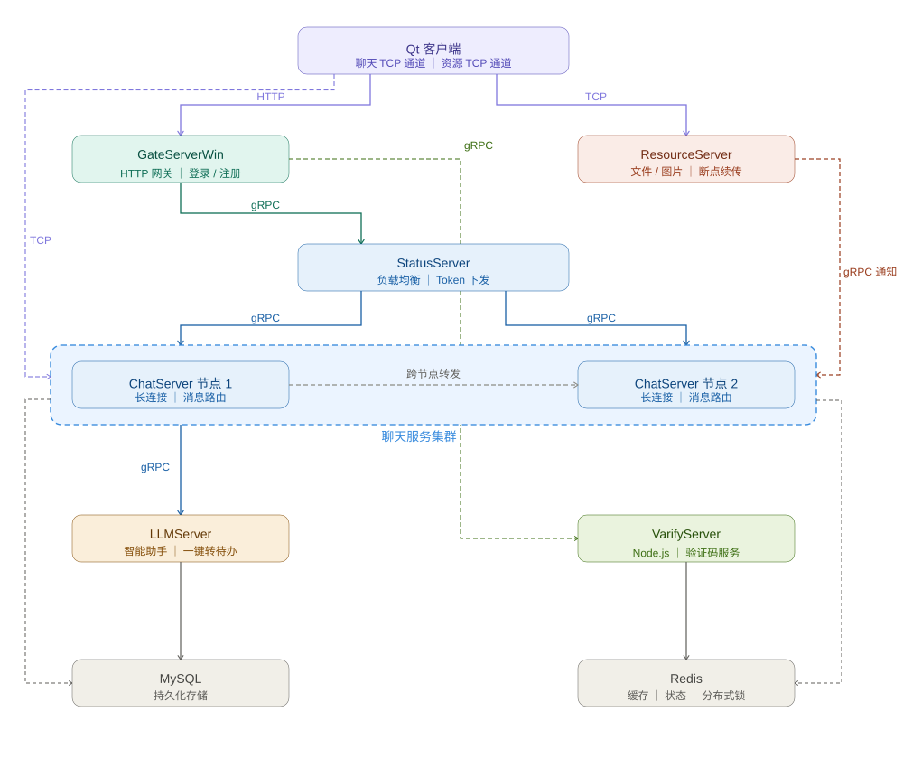

<div align="center">


# 🧠 MindChat

**面向办公协作的分布式即时通讯平台，深度集成 AI 大模型**

[](https://isocpp.org/)
[](https://www.qt.io/)
[](https://grpc.io/)
[](https://redis.io/)
[](https://www.mysql.com/)
[](LICENSE)

[功能演示](#功能演示) · [架构设计](#系统架构) · [快速部署](#部署指南) · [压测报告](#压力测试)

</div>

---

## 📖 项目简介

MindChat 是一个**面向办公协作场景**的分布式即时通讯平台，核心亮点在于深度集成 AI 大模型，提供**智能聊天助手**与**自然语言一键转写任务**两大创新功能。

后端采用微服务架构，通过 gRPC 实现服务间高效通信；数据层使用 MySQL 持久化 + Redis 缓存；客户端基于 Qt 实现跨平台图形交互。

### ✨ 核心特性

- 🤖 **AI 聊天助手** — 内置 LLM 对话助理，支持连续多轮会话
- 📋 **智能待办解析** — 自然语言一键转结构化任务（标题 / 时间 / 地点 / 置信度）
- 📡 **分布式微服务** — 七大服务节点协作，支持水平扩展
- 🔄 **断点续传** — 文件分块上传 + 拥塞控制，网络中断可续传
- ⚖️ **动态负载均衡** — 基于 Redis 节点状态的实时请求分发
- 💪 **高并发验证** — 单节点支持 ~18k 稳定连接（P95 ≤ 200ms）

---

## 🏗️ 系统架构



### 服务职责一览

| 服务                       | 技术                  | 职责                                 |
| -------------------------- | --------------------- | ------------------------------------ |
| `GateServerWin`            | Boost.Beast HTTP      | 登录 / 注册 / 重置密码入口           |
| `StatusServer`             | gRPC                  | 负载均衡分发、Token 生成与下发       |
| `ChatServer / ChatServer2` | Boost.Asio TCP + gRPC | 长连接消息收发、会话管理、跨节点转发 |
| `ResourceServer`           | 自定义 TCP 分块协议   | 文件 / 图片 / 头像上传下载、断点续传 |
| `LLMServer`                | HTTP + Provider 池    | AI 对话代理、自然语言待办解析        |
| `VarifyServer`             | Node.js + gRPC        | 邮件验证码生成与校验                 |

---

## 🚀 功能演示

### 登录与连接建立


登录时由 `StatusServer` 读取 Redis 各节点连接计数，将请求路由至负载最低的 ChatServer 节点，同时下发 Token 和服务地址。客户端随即建立**聊天 TCP** 与**资源 TCP** 双通道连接。

---

### 注册 & 密码重置


---

### 好友管理（搜索 → 申请 → 确认）


好友申请支持跨节点通知：同节点直接推送，跨节点通过 gRPC 转发；好友关系写入采用固定顺序事务，降低死锁概率。

---

### 文本聊天


---

### 🤖 AI 聊天助手


在会话列表选择「LLM 助理」即可发起对话。`ChatServer` 识别目标为 LLM 助理后，组装上下文调用 `LLMServer`，助手回复落库并实时推送至客户端，支持连续多轮对话。

---

### 📋 智能待办解析（AI 驱动）


用户在聊天框触发「一键转待办」，系统调用 LLM 解析自然语言（例如：*"明天下午三点和产品开评审会"*），返回结构化字段：

```json
{
  "title": "产品评审会",
  "event": "会议",
  "time": "2026-02-18 15:00",
  "location": "",
  "confidence": 0.95
}
```

用户确认后一键落库，支持创建 / 查询 / 更新 / 删除 / 状态切换。

---

### 文件传输与断点续传


采用分块上传协议，Redis 记录每片进度（含 TTL）。网络中断后从最后确认分片续传，客户端维护轻量拥塞窗口控制在飞分片数量，UI 实时显示传输进度。

---

### 头像上传


---

## 🛠️ 技术栈

| 方向       | 技术选型                                                        |
| ---------- | --------------------------------------------------------------- |
| 网络层     | Boost.Asio / Beast，异步 TCP 长连接 + HTTP 接口                 |
| 服务间通信 | gRPC + Protobuf                                                 |
| AI 集成    | LLMServer 多 Key / 多地址池，轮询 + 失败重试，结构化输出解析    |
| 并发模型   | `io_context` 池 + 逻辑线程 + 资源工作线程分层处理               |
| 数据存储   | MySQL 持久化 + Redis 缓存 / 状态管理                            |
| 分布式锁   | Redis `SET NX EX + Lua` 原子操作                                |
| 连接池     | MySQL 连接池（含保活）、Redis 连接池、gRPC stub 池              |
| 文件传输   | 分块协议 + 断点续传 + 拥塞窗口控制                              |
| 客户端     | Qt，信号槽解耦，异步事件驱动                                    |
| 工程模式   | 单例、生产者-消费者、RAII、类型擦除分发（`std::function` 映射） |

---

## 🔍 设计亮点

<details>
<summary><b>⚖️ 动态负载均衡与水平扩展</b></summary>


`StatusServer` 在登录阶段读取 Redis 中各 ChatServer 节点的实时连接计数，将请求路由至当前压力最低的节点，并下发对应地址与 Token。新增聊天节点直接接入即可完成水平扩展，无需修改其他服务。

</details>

<details>
<summary><b>🤖 高可用 AI 服务设计</b></summary>


`LLMServer` 的 `ProviderPool` 实现了多 Key / 多地址轮询与失败重试机制。模型瞬时不可用时触发兜底逻辑，不中断业务主流程，保障 AI 功能对核心消息链路零影响。

</details>

<details>
<summary><b>🔄 断点续传与拥塞控制</b></summary>


资源传输采用分块协议，服务端将上传 / 下载进度写入 Redis（带 TTL），网络中断后可从最后确认序号续传。客户端维护轻量拥塞窗口，根据回包动态推进确认序列，在抖动网络下保持稳定吞吐。

</details>

<details>
<summary><b>🔒 分布式锁与死锁规避</b></summary>


登录绑定、连接计数等关键并发路径使用 Redis 分布式锁（`SET NX EX + Lua`）保证原子性。好友关系写入时采用固定顺序插入，降低事务锁反转导致死锁的概率。

</details>

<details>
<summary><b>💓 心跳检测与僵尸连接回收</b></summary>


客户端按固定周期发送心跳，服务端在 Session 中维护最后活跃时间戳，定时任务扫描超时连接并主动回收会话与在线状态，防止异常连接长期占用资源。

</details>

<details>
<summary><b>📱 聊天与资源双通道隔离</b></summary>


客户端同时维护聊天 TCP 通道和资源 TCP 通道，文本消息与大文件传输不争抢同一链路，传输文件时不影响会话交互体验。

</details>

<details>
<summary><b>🔀 类型擦除消息分发</b></summary>


消息分发层以 `std::function` + 统一回调签名建立消息 ID 到处理函数的映射，替代大段 `switch-case`。扩展协议时只需注册新处理器，不影响已有逻辑。

</details>

---

## 📁 项目结构

```
MindChat/
├── ChatServer/          # 聊天服务节点 1（TCP + gRPC）
├── ChatServer2/         # 聊天服务节点 2（TCP + gRPC）
├── GateServerWin/       # 网关服务（HTTP 入口：登录 / 注册 / 重置）
├── StatusServer/        # 状态与路由服务（负载均衡、Token 下发）
├── ResourceServer/      # 资源服务（文件 / 图片 / 头像、断点续传）
├── LLMServer/           # LLM 代理服务（/chat, /extract_todo）
├── VarifyServer/        # Node.js 验证码服务（gRPC）
├── myChatQT/            # Qt 客户端
├── scripts/             # 运维脚本（一键启停、切库）
├── stress_tests/        # 压测脚本与说明
├── sql备份/             # 数据库结构与补丁 SQL
├── DEPLOYMENT.md        # 服务端部署手册
├── CMakeLists.txt       # 服务端构建入口
└── vcpkg.json           # C++ 依赖声明
```

---

## 📦 部署指南

### 环境要求

```bash
# 系统依赖
sudo apt update
sudo apt install -y build-essential cmake ninja-build pkg-config curl zip unzip tar

# 运行依赖
sudo apt install -y redis-server mysql-server

# Node.js（推荐 nvm）
curl -fsSL https://raw.githubusercontent.com/nvm-sh/nvm/v0.40.1/install.sh | bash
source ~/.bashrc
nvm install --lts
```

**vcpkg**（假设安装在 `/home/<you>/vcpkg`）

```bash
cd /path/to/MindChat
/home/<you>/vcpkg/vcpkg install --triplet x64-linux
```

所有 C++ 依赖（Boost / gRPC / Protobuf / hiredis / MySQL Connector / jsoncpp 等）均由 `vcpkg.json` 统一管理。

---

### 配置

**Redis** — 确保服务端密码为 `123456`：

```ini
# /etc/redis/redis.conf
requirepass 123456
```

```bash
sudo systemctl restart redis-server
redis-cli -h 127.0.0.1 -p 6379 -a 123456 PING  # 返回 PONG 即正常
```

**MySQL** — 导入数据库结构：

```bash
mysql -h 127.0.0.1 -P 33060 -u root -p < "sql备份/MindChat.sql"
```

**VarifyServer**：

```bash
cd VarifyServer && npm install
```

---

### 编译

> ⚠️ 从 Windows 迁移时需在 Linux 重新生成 pb 文件：
>
> ```bash
> # 在各服务目录下执行
> protoc -I . --cpp_out=. --grpc_out=. \
> --plugin=protoc-gen-grpc=$(which grpc_cpp_plugin) message.proto
> ```

```bash
cmake -S . -B build \
  -G "Unix Makefiles" \
  -DCMAKE_BUILD_TYPE=Release \
  -DCMAKE_TOOLCHAIN_FILE=/home/<you>/vcpkg/scripts/buildsystems/vcpkg.cmake \
  -DVCPKG_TARGET_TRIPLET=x64-linux

cmake --build build -j
```

---

### 一键启动

```bash
# 启动所有服务
scripts/manage_services.sh start build

# 查看服务状态
scripts/manage_services.sh status

# 查看单服务日志
scripts/manage_services.sh logs GateServerWin

# 停止所有服务
scripts/manage_services.sh stop
```

**启动顺序：** Redis / MySQL → VarifyServer → LLMServer → StatusServer → ChatServer → ChatServer2 → ResourceServer → GateServerWin

**环境变量选项：**

```bash
REDIS_START_CMD='service redis-server start' \
MYSQL_START_CMD='service mysql start' \
scripts/manage_services.sh start build

# VarifyServer 缺依赖时自动安装
VARIFY_AUTO_NPM_INSTALL=1 scripts/manage_services.sh start build
```

---

### 客户端

1. Qt Creator 打开 `myChatQT/myChatQT.pro`，配置编译套件后构建运行
2. 按需修改 `myChatQT/config.ini` 中的网关地址和端口

---

## 📊 压力测试

> 服务端运行于 WSL（AMD 9700x），压测端为独立 Linux 服务器。

### 测试结果

| 场景                           | 结果                           |
| ------------------------------ | ------------------------------ |
| 稳定连接上限（P95 ≤ 200ms）    | **~18,000 连接**               |
| 1 万连接稳定性（持续 10 分钟） | ✅ 无丢包、无断线，延迟约 150ms |
| PingPong 协议（100ms 约束）    | **~1,000 连接**                |

### 运行压测

**准备环境：**

```bash
scripts/switch_db.sh stress_mysql

python3 stress_tests/run_stress.py \
  --gate-host 10.204.128.192 --gate-port 8080 \
  --default-chat-host 10.204.128.192 \
  --user-prefix stress_u_ --user-start 300000 --password abc123 \
  prepare --seed-users 20000
```

**测试一：连接上限（P95 ≤ 460ms）**

```bash
python3 stress_tests/run_stress.py \
  --gate-host 10.204.128.192 --gate-port 8080 --default-chat-host 10.204.128.192 \
  --user-prefix stress_u_ --user-start 300000 --password abc123 \
  --connect-batch-size 100 --connect-batch-interval-ms 200 \
  conn-limit \
  --start-connections 400 --step-connections 200 --max-connections 20000 \
  --latency-threshold-ms 460
```

**测试二：严格 SLO（P95 ≤ 100ms）**

```bash
python3 stress_tests/run_stress.py \
  --gate-host 10.204.128.192 --gate-port 8080 --default-chat-host 10.204.128.192 \
  --user-prefix stress_u_ --user-start 300000 --password abc123 \
  --connect-batch-size 30 --connect-batch-interval-ms 250 \
  conn-limit \
  --start-connections 200 --step-connections 100 --max-connections 2000 \
  --latency-threshold-ms 100
```

**测试三：1 万连接稳定性（10 分钟）**

```bash
python3 stress_tests/run_stress.py \
  --gate-host 10.204.128.192 --gate-port 8080 --default-chat-host 10.204.128.192 \
  --user-prefix stress_u_ --user-start 300000 --password abc123 \
  --connect-batch-size 100 --connect-batch-interval-ms 200 \
  stability \
  --connections 10000 --duration-sec 600 --latency-threshold-ms 150
```

**测试四：PingPong 容量（100ms 约束）**

```bash
python3 stress_tests/run_stress.py \
  --gate-host 10.204.128.192 --gate-port 8080 --default-chat-host 10.204.128.192 \
  --user-prefix stress_u_ --user-start 300000 --password abc123 \
  --connect-batch-size 30 --connect-batch-interval-ms 200 \
  pingpong-limit \
  --start-connections 200 --step-connections 200 --max-connections 5000 \
  --ping-interval-ms 100 --latency-threshold-ms 100
```

压测日志输出至：`logs/stress/<timestamp_mode>/`

**恢复工作数据库：**

```bash
scripts/switch_db.sh myChat
```

---

<div align="center">


Made with ❤️ using C++ · Qt · gRPC · Redis · AI

</div>